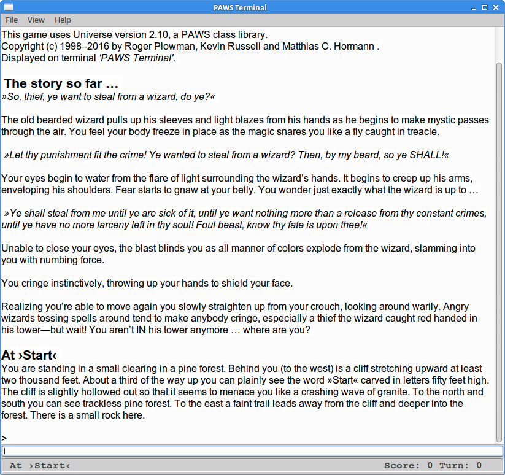
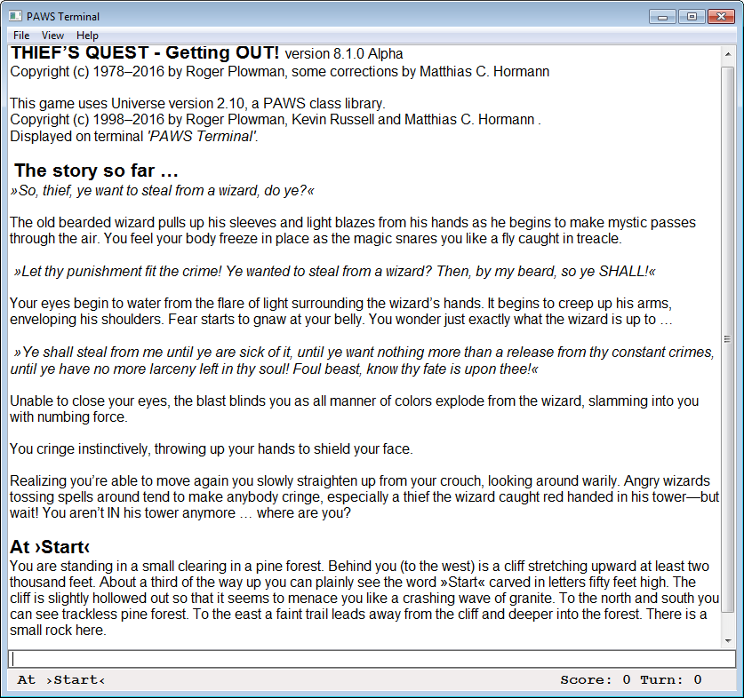

PAWS 2.1
========

PAWS stands for **Python Adventure Writing System**. It was originally written by **Roger Plowman**. Essentially it’s a python library which allows you to write your own text adventure games. What I liked about this library is that it has a huge technical document explaining every class and method. On top of that the code is hugely commented and there is an example and tutorial with lots of comment to get you started. In olden times, you could get it from http://home.fuse.net/wolfonenet/PAWS.htm.

The project seems abandonend since about 2008, the web page doesn’t exist anymore and Roger Plowman unreachable. I strongly feel this interesting and well-working system to write and run Interactive Fiction should be kept from vanishing in the dark realms of Nowhereland and it could also benefit from a little polishing and a few extensions, especially for foreign languages like German.

So I went about keeping and improving an already very sophisticated and well-written system and create what I blatantly call PAWS 2.1, while trying to keep it compatible with the olden but golden version 1.5 and 2.0.3 games out there, like the included "Thief’s Quest" (also written by Roger Plowman).

It still requires **Python 2.7** to run, and **wxPython** being installed (either the older "unicode"-versions or the newer Unicode-only version). [WxPython.org](https://wxpython.org/) even have [installers for Windows & MacOS](https://wxpython.org/download.php#msw).

**May PAWS never die and the Creative Force be with you!**


## Some technical stuff

### PAWS 2.1 does Unicode!

PAWS 2.1 is fully Unicode-aware and will play nicely with all these beautiful characters from almost every language (finally!). For new games, you should therefore specify the source file’s _encoding_ within the first two lines like this (it should always be UTF-8):

````python
# -*- coding: utf-8 -*-
````

Also, each and every string literal in your game should be a Unicode string, like this (notice the lowercase _u_ before the strings):

````python
self.SetDesc(u"Odor", u"All I can smell is fresh air.")
````

### PAWS 2.1 works on Linux, Mac, Windows, …

Yeah, really. Almost on every machine that you can manage to install _Python 2.7_ and _wxPython_ on. And this version even gets all these beautiful Unicode characters right. See the _screenshots_ at the end of this page.

### Making a well-built game universe

Currently, the game "Universe" (i.e. `PAWS/Universe.py`) is the part I spend most time on.

The goal is not to break existing games, but have a fully-functional game universe that can handle an enormous amount of places, actions and user input—all by itself.

Thus, it shall be easier and easier to put your own game "on top" of it, have a robust foundation that can handle _a lot_ itself and still allows you to override/re-specify the default places, actions and behaviour if you wish to do so. Hopefully without ever needing to change a line of code inside of what’s in the `PAWS` folder!

### Playing older games (v1.5/2.0.3)

I very much tried to keep the core and PAWS’ "Universe" compatible with older games, like from version 1.5 and 2.0.3. You’ll probably only have to change the following two lines in those games’ source files:

_Change …_

````python
from PAWS import *
from Universe import *
````

_to …_

````python
from PAWS.Core import *
from PAWS.Universe import *
````

and—in most cases—you should be ready to run! This is how I got Roger’s original **Thieves’ Quest** game up and running again. (Which is included in a slightly debugged and Unicode-friendly version.)

### Bugs fixed

I found and tried to repair a lot of bugs, some in the _Core_ and most of them in the _Universe_ module which led to erratic behaviour in the game and lots of error messages on the console. Surely I didn’t find everything (and will probably try to fix more), so all the fault is mine and all the credit should go to _Roger Plowman_.

### Documentation (How to write your own Adventure)

Unfortunately, I couldn’t get hold of Roger’s great manuals for the 2.0.3 version. Sadly, you’ll have to make with the included manuals of version 1.5, and adapt a little here and there. They’re still worth reading, though. If anyone knows about or even _has_ the version 2.0.3 manuals, **please let me know!**

For completeness, I’ve included everything I could still find on the Internet within the `/docs` folder, even the old `PAWS20-Player.zip` that only contains the Windows executables for version 2.0. _You should never need this,_ it’s just for reference and because the original license stated it should be included.

**Making PAWS work in other languages than English:** Even though I laid the groundwork—making PAWS fully Unicode-aware—, changing it to work with languages other than English will be a major task. The built-in parser (that part that tries to "understand" the sentences and commands you type in) is hard-coded for English in so many places and would have to be completely replaced. Be warned: Writing a parser for natural-language-like sentences is _not_ an easy task!

If you were to start such a massive approach, I’d suggest to follow a route like this:

* Do _not_ change anything in the `PAWS` folder, i.e., `__init__.py`, `Core.py`, `Terminal.py` or `TerminalFrame.py`. These constitute the main engine which should not be changed, or it will be nearly impossible for me to develop it further. (And for you to use all the new features that might come up.)
* Do write a new "Universe" and name it after your language, like `Universe.de.py` for German. This will make it easier in a later version to maybe switch languages (and/or "universes"). Place this new file in the `PAWS` folder.
* The "Universe" makes the groundwork for any PAWS game. It makes your adventure world know the world rules, how it should behave, and defines lots of basic places, actions and verbs. Also, the parser module from `Core.py` can be overlaid in here, effectively making _your_ game use the parser from _your_ `Universe.xx.py` and not the built-in one.
* Apart from the parser (language rules are different in different cultures), try to make the universe use the same classes, methods and functions the original one has. This will make switching languages much easier in the long run, because the game can rely on the same "world" being available in whatever language. It also makes it easier for you and me, should I ever extend the original English `Universe.py`.
* Write your game (and/or adapt an existing one), using whatever kind of world and parser you made in your `Universe.xx.py`. Give your game file a self-explanatory name and place it into the main folder, i.e. `MyGame.py` so it can easily be found by `LoadTerminal.pyy` in the _File → Pick Game_ menu.

### Other miscellanea on the Internet

* Roger’s original page (seems gone): http://home.fuse.net/wolfonenet/PAWS.htm
* [PAWS Version 2.0.3 on Archive.org’s Wayback Machine](https://web.archive.org/web/20150219103902/http://home.fuse.net/wolfonenet/PAWS.htm). Sadly, no source file ZIPs and manuals.
* [Parsiya’s Malware Adventure](https://github.com/parsiya/malwareadventure). This is where I found the seemingly last v2.0.3 PAWS playing modules, the base of my work with this version.
* [Roger Firth’s »Cloak of Darkness«](http://www.firthworks.com/roger/). A well-defined mini adventure, coded in many different languages (playable PAWS version included here).
* The [rec.arts.int-fiction forum](https://groups.google.com/forum/#!forum/rec.arts.int-fiction) on Google Groups, a place to meet interesting people and find out much more about Interactive Fiction (a.k.a. Text Adventures).


## Collaboration

* If you find any **bugs**, use the [Issues tracker](https://github.com/Moonbase59/PAWS/issues) on this page to let me know.
* If you have any **great ideas** that might benefit the base engine (mostly Universe) and a general public, please also let me know on the [Issues tracker](https://github.com/Moonbase59/PAWS/issues). The Universe will probably be the main part that gets extended for some time still.
* Should you wish to add to the code, or have some better ideas, by all means **fork this repo and make pull requests!**
* Should you decide to write your own Adventure using PAWS, I’d be delighted to hear from you. If anyhow feasible, it’d be just _great_ if you also **publish your Adventure here on GitHub and leave it Free and Open Source Software!** _(And leave me a link, so I can make a page with all your beautiful PAWS Adventures!)_

Whenever I have some spare time, I’ll go over the issues/bugs and possible extensions and maybe even fix or implement them. 😉

## How to play Adventures

Git clone (or download) this repo, change directory to where `LoadTerminal.pyy` lives, and start it, i.e.

```` bash
cd /home/username
git clone https://github.com/Moonbase59/PAWS.git Adventures
cd Adventures
python LoadTerminal.pyy
````

Alternatively, on some Linux DEs like _XFCE_ or _Cinnamon_, you can create a so-called "Desktop Starter" like the following one and simply double-click it’s icon on the Desktop to play.

```` ini
[Desktop Entry]
Version=1.0
Type=Application
Name=PAWS Adventures
Comment=Start a selection of PAWS Adventures
Exec=python LoadTerminal.pyy
Icon=
Path=/home/username/Adventures
Terminal=false
StartupNotify=false
````

To avoid complaints from the desktop environment, you _might_ need to make the newly-created starter executable.

Once started, from PAWS’ terminal window select **File/Pick Game …**, pick a game and play it. Games are all the `*.py` files in the starting directory. This is also why we used the extension `*.pyy` for `LoadTerminal` – it won’t show up in the game file browser.

   
_Linux Screenshot_

   
_Windows Screenshot_

**Have fun!**
